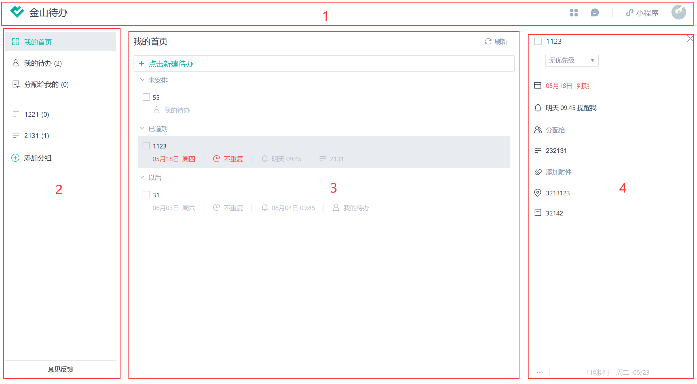
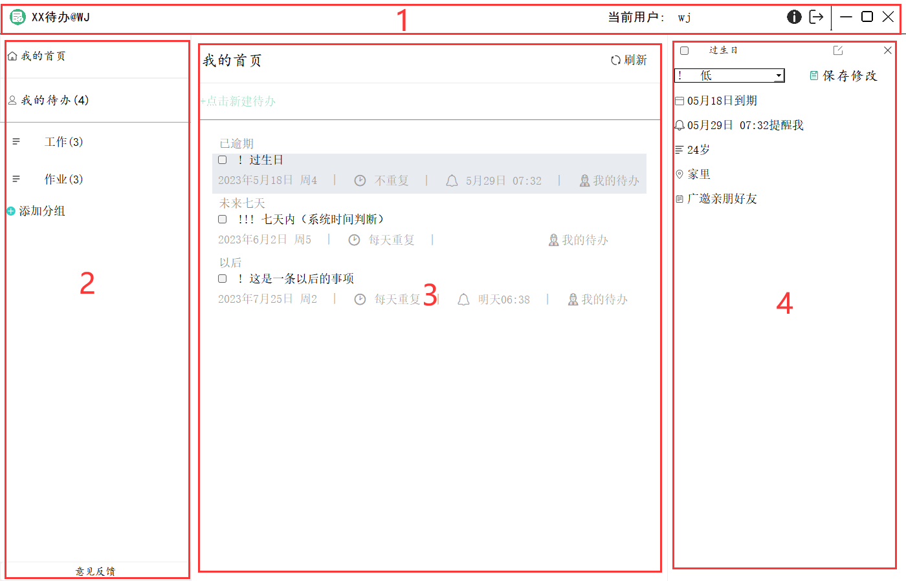
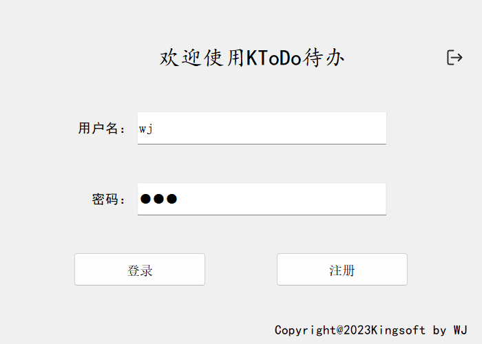
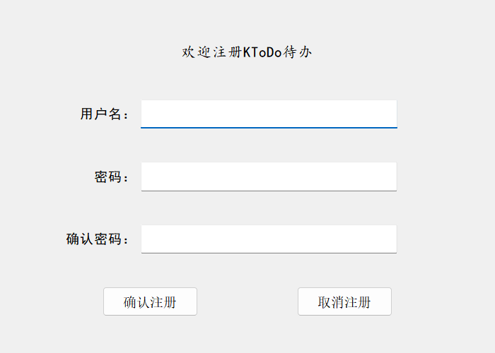
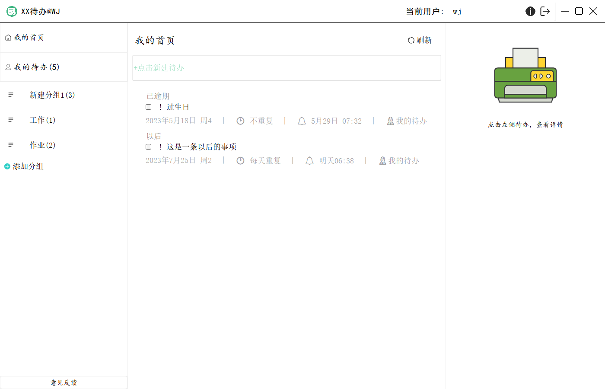
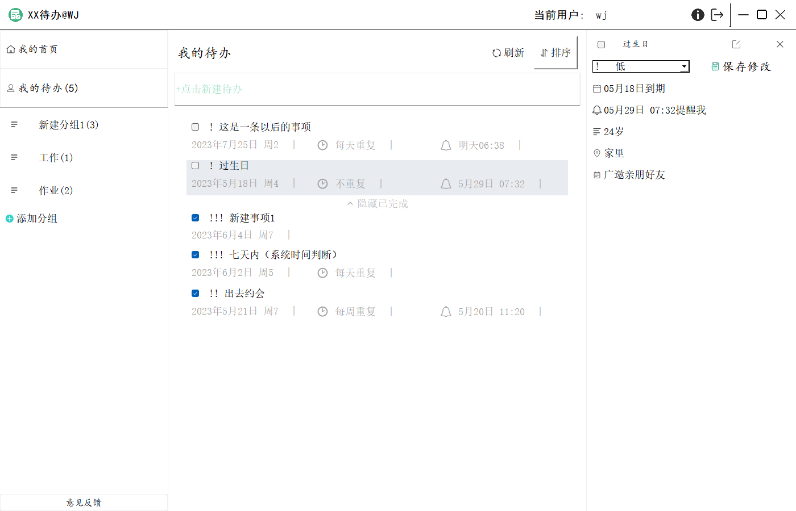
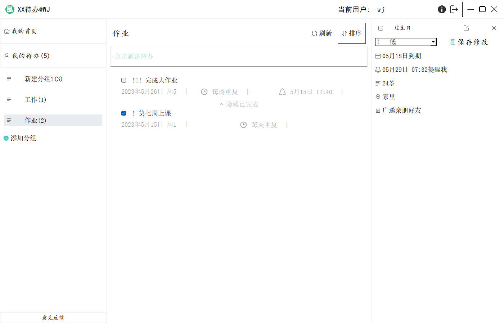
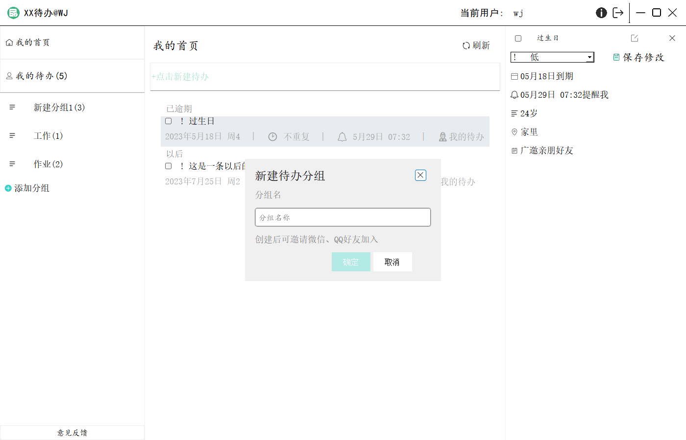

# 最终的大作业

## 需求分析

`url` :  `https://www.kdocs.cn/l/co08mjty058r?openfrom=docs`

**完成度**

1、我的首页：

- [x] 新建待办项目
- [x] 展示所有代办项目   
- [x] 刷新   （刷新页面可以实现初始化待办事件显示，但是删库的话不能直接从数据库中更新数据）

2、我的待办

- [x] 展示所有待办项目     
- [x] 刷新   （刷新页面可以实现初始化待办事件显示和分类信息，但是删库的话不能直接从数据库中更新数据）
- [x] 排序   
- [x] 新建代办项目   

3、分组

- [x] 新建分组  
- [x] 新建待办项目   
- [x] 展示分组中的待办项目   
- [x] 刷新  （同上）
- [x] 排序   

4、代办事件

- [x] 是否完成该事件	
- [x] 展示待办事件的详细信息	
- [x] 进一步设置待办事件的详细信息     

## 概要设计

此次作业主要是仿金山待办[金山待办 (wps.cn)](https://todo.wps.cn/)完成一个待办系统，我的设计思路主要是将整个页面分为4个区域——顶部标题栏、左侧分组导航区、中部事项条陈区、右侧详细信息区。





为了不同的区域都有实现自身职能并且各区域之间能够产生联动，本次作业将上述几个区域的职能进行划分：

- 顶部标题栏
  - 重写标题栏的一些功能

- 左侧分组导航区
  - 实现两个页面：`我的首页` 和 `我的待办` 之间的切换
  - 能够添加分组，并实现分组之间的切换
  - 意见反馈（直接跳转至url）

- 中部事项条陈区
  - 显示当前页面或当前组别的名称
  - 排序和刷新功能
  - 在`我的首页`隐藏排序按钮，在`我的待办`显示出来
  - 最主要的输入框，能创建新的待办事项
  - 分类显示创建的待办事项，且各页面显示不同：在`我的首页`显示四类（未安排、已逾期、未来七天、以后）；在`我的待办`显示两类：（未完成、已完成）
  - 每一条待办事项显示出部分信息：（名称、优先级、到期时间、提醒时间、重复、组别名）
  - 勾选框——是否完成
- 右侧详细信息区
  - 勾选框——是否完成
  - 修改事项名称
  - 增加、修改优先级
  - 增加、修改提醒时间
  - 增加、修改结束时间
  - 增加、修改重复设置
  - 增加、修改描述
  - 增加、修改地点
  - 增加、修改备注

## 详细设计

### 类的设计

本次代码作业中，主要设计了以下几个类：

- 数据库类 `KDBConnect`

  采用**防注入写法**，在初始化时创建三个数据表：用户表、组别表、待办事项表；

  使用静态局部变量的**懒汉单例**实现数据库创建（C++11标准）。

- 登录类 `KLoginPage` & 注册类 `KRegisterPage`

  用户输入登录信息和注册信息进行**合法性检验**，注册后数据存入数据库中；

  单击主页面的注销按钮可以返回到登录页面，登录的用户名显示在主页面标题栏中；

- 主窗口类 `KTodoMainWindow`

  主要实现各组件之间的布局和组件之间的响应；

  实现`我的首页`和`我的待办`两个页面之间的切换；

  实现右侧待办事项详细信息区的功能，将新增或修改后的数据写入或更新到数据库。

- 待办事项条陈类 `KTodoItems`

  主要布局组件是**`QLabel`**，因为只需要展示一些信息（名称、优先级、到期时间、提醒时间、重复、组别名），不可选中不可修改；

  该类对象实现**全局互斥**，鼠标左键点击一个待办事项`item`，只有这个`item`对象被操作（修改信息等），其他事项不被影响；

- 组别类`KBtnShowGroupTodo`

  主要布局组件是**`QPushButton`**，因为要实现不同组别之间的待办事项切换，根据数据库中的`groupId`字段进行判断；

  该类对象实现**全局互斥**，鼠标左键点击一个组别`group`，即在中部事项条陈区显示当前`group`下的待办事项，并且只对该对象进行操作，其他组别不受影响；

- 添加分组弹窗类`KAddGroupDialog`

  因为在金山待办中`添加分组`按钮总是于组别区域保持一个相对位置，因此这里对该按钮使用代码设计，没有使用ui生成，弹窗进行了动画设计。

- 输入框组件类`KLineEdit`

  在主页面中该组件最为重要，因此将`QLineEdit`提升为`KLineEdit`，在输入框中输入待办事项名称后即可新建待办事项，并将事项id、事项名称、创建时间、是否完成（默认false）、组别名称等信息加入到数据库中。

- 时间盒子弹窗类`KTimerBox`

  包括日期选择器`QCalendarWidget`组件、提醒时间`QTimeEdit`组件、设置重复`QComboBox`组件、取消按钮、确定按钮等，在设置到期时间中隐藏`QTimeEdit`，在设置提醒中隐藏`QComboBox`。

- 帮助类 `KLearnMore`

  主页面中 `？`按钮的帮助文档

### 内存管理

本次代码作业中的内存管理

- 数据存储

  因为要实现的功能较多、因此存储方式存在差异

  ```c++
  //待办事项条陈的存储：
  KTodoItems* m_pCurrentItems;	//当前操作的待办事项todoItems
  QList<KTodoItems*> m_listTodoLists;		//所有的todoItems用QList存储，作为主要存储单位，方便管理
  QMap<int, KTodoItems*> m_mapTodoItems;		//存储todoItems的id和对象指针，用于排序
  QMap<int, QList<KTodoItems*>> m_mapListTodoItems;		//根据id存储todoItems，用map+list存储形如：分组[size]，也就是一种分组下有几个todoItems，这是进行组别互斥的主要存储单位
  ```

  ```c++
  //待办组别的存储：
  KBtnShowGroupTodo* m_pCurrentGroups;	//当前操作的组别todoGroups
  QList<KBtnShowGroupTodo*> m_listTodoGroups;		//所有的todoGroups用QList存储，作为主要存储单位，方便管理
  QList<int> m_listGroupIds;		//将选中的组别的id存为一个list，用于获取当前组别下的items的数量
  QMap<int, KBtnShowGroupTodo*> m_mapTodoGroups;	//根据id存储todoGroups，在新增时保存todoItems的id和todoGroups的关系，用于组别互斥
  
  ```

  

- 内存释放

  使用`Qt`中`STL`提供的**erase**接口删除数据元素，进行内存管理。

  ```c++
  //适用迭代器删除存储todo事项和todo分组的存储容器
  	for (QList<KTodoItems*>::iterator it = m_listTodoLists.begin(); it != m_listTodoLists.end(); ++it)
  	{
  		if (m_listTodoLists.size() > 0)
  		{
  			it = m_listTodoLists.erase(it);	//改变迭代器的指向
  		}
  		else
  		{
  			m_listTodoLists.clear();
  			break;	//必须要有，否则仍然会使用这个错误的迭代器，造成报错
  		}
  	}
  ```

  使用这个接口去删除元素数据时，会改变迭代器的指向，目标元素被删除后，指向该元素的迭代器会自动指向下一个目标元素。

## 页面展示

登录&注册





我的首页



我的待办



分组



添加分组



## 不足

- 刷新按钮只进行了初始化各个组件信息的设计，不能在数据库中对表进行修改、删除等操作之后再进行刷新（无效）；
- 右侧下方的三个组件 鼠标单击其他位置将其收起的功能，进行了尝试（代码已注掉），但是这里会导致一个组件互斥引起的地址访问冲突问题，出于时间问题没有设计组件收起；

- 没有很多的动画设计
